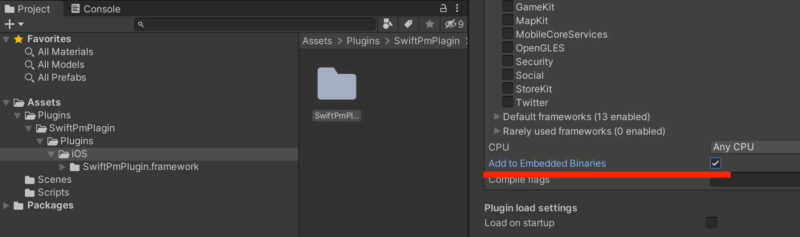

# monitoring-sdk-ios

Native plugin for Unity using Swift for iOS platform to monitor CPU, GPU, and RAM usage. The plugin consist of two functions, "StartTracking" and "StopTracking." The "StopTracking" function will return the tracked data for CPU, GPU, and RAM usage.

## Build Framework for iOS

```
$ make build
```

This should result in `MonitoringDevice.framework` being generated in `Build`.  
Copy the built framework into your Unity project's `Assets/Plugins/iOS`.  
Enable `Add To Embedded Binaries` in the Unity Inspector of `MonitoringDevice.framework`.



# C# Implementation

A simple example to implement the plugin in C# is provided in [MonitoringDeviceImplementation.cs](UnityExample/Assets/Scripts/MonitoringDeviceImplementation.cs).

For more information about how to call the swift SDK in C#, check [SwiftBridge.cs](UnityExample/Assets/monitoring-sdk-ios/scripts/SwiftBridge.cs) for details.

